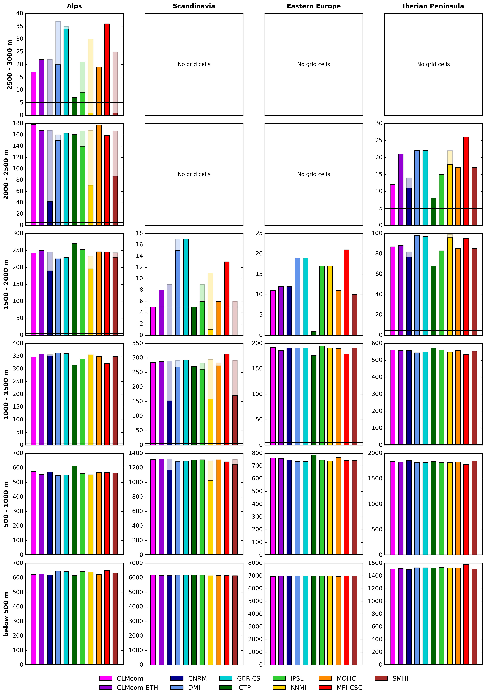

## Input Data

The EURO-CORDEX Regional climate model (RCM) output is used for the period **1971–2100** for the following variables:

- precipitation
- near-surface air temperature
- snow water equivalent (SWE)
- snow depth (SD)

All datasets are publicly accessible via the **Copernicus Climate Data Store (CDS)**:

- https://cds.climate.copernicus.eu/datasets/projections-cordex-domains-single-levels?tab=download

### Model selection and exclusions

Several simulations were excluded to ensure a homogeneous ensemble:

- Simulations from **SMHI** and **CLMcom** driven by **CNRM** were excluded, because the historical period is forced by a different GCM realisation than the scenario simulations.
- The **WRF361** model was omitted because SWE was not provided and no corresponding reanalysis-driven simulation is available.

Note: the ensemble size and the combination of RCMs and GCMs can differ between scenarios.

## Workflow

### Time definitions

| Time Slice | Period |
|------------|--------|
| Historical | 1971–2000 |
| Near future | 2021–2050 |
| Far future | 2070–2099 |

In Europe, SWE exhibits a pronounced seasonal cycle with a maximum during Northern Hemisphere winter. Analyses are therefore focused on the winter season.

- **Hydrological year**: year *n* is defined as **September (year n)** to **August (year n+1)**.
- **Winter half-year**: defined as **November (year n)** to **April (year n+1)**.

**For example:**

- 1971–2000 winter means use winters from **Nov 1971** to **Apr 2001**.
- 2021–2050 spans winters from **Nov 2021** to **Apr 2051**.
- 2069–2098 spans winters from **Nov 2069** to **Apr 2099**.

Scenario simulations were terminated in **April 2099** to ensure consistency with HadGEM-driven GCM simulations that are only available until the end of 2099.

### Homogenisation steps

Several steps are applied to obtain a homogeneous ensemble.

#### Substitute missing SWE

Not all RCMs provide SWE. In simulations without SWE, SWE is estimated from snow depth (SD) assuming a constant snow density of $\rho_{\mathrm{snow}} = 312\ \mathrm{kg\,m^{-3}}$ (Sturm et al., 2010):

$$
\mathrm{SWE}\,[\mathrm{kg\,m^{-2}}] = \mathrm{SD}\,[\mathrm{m}] \times \rho_{\mathrm{snow}}\,[\mathrm{kg\,m^{-3}}]
$$

This method is evaluated in detail in Steger (2026).

#### Snow accumulation artifacts

Some RCM grid cells exhibit unrealistically persistent snow accumulation due to model deficiencies and missing glacier representation. To exclude these artifacts, grid cells were masked if they showed:

- a minimum annual SWE exceeding **10 mm** for more than **five consecutive years**, and/or
- artificially capped or prescribed snow values.

All subsequent snow analyses are restricted to the remaining grid cells (details in Steger, 2026).

Area means are only computed if at least **5 grid boxes** remain after masking. In some cases this leads to exclusion of a particular RCM simulation for the highest elevation bands.

{ width="60%" }

#### Fixed fields

- A common **land–sea mask** is applied across the entire RCM ensemble. Land grid points are defined where at least **50%** of the surface is classified as land in **all** RCMs.
- Because orography differs between RCMs (Steger, 2026), elevation classes are defined **separately for each model** using its native orography and 500 m intervals.

#### Remapping

Area means are computed on the native grids of the individual simulations. For horizontal (map-based) analyses, all simulations are brought onto a common grid.

- The simulations **ALADIN63** and **RegCM4-6** are remapped to the standard EURO-CORDEX **0.11°** grid using **conservative remapping** (`remapcon`) in CDO.
- **MPI-CSC-REMO2009** is provided on a shifted EURO-CORDEX grid and is re-aligned to the standard EURO-CORDEX **0.11°** grid using `cdo setgrid`.

### References

- Christian Steger (2026)
- Sturm, M. et al. (2010): Snow density reference.
- Schulzweida, U. (2019): Climate Data Operators (CDO), Zenodo. https://doi.org/10.5281/zenodo.3539275
