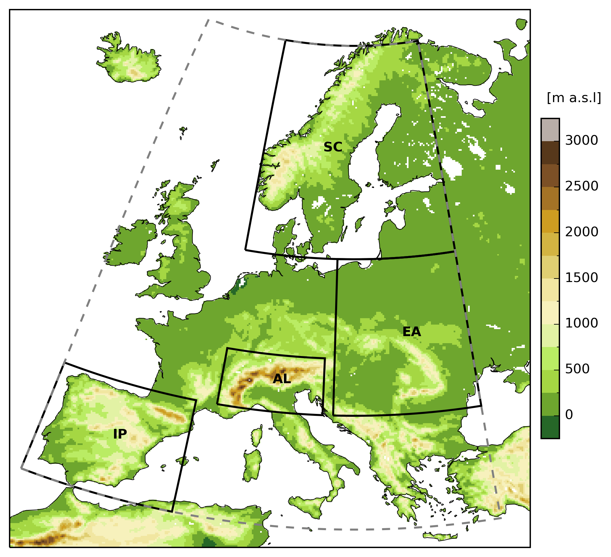

# Introduction

This study investigates the projected evolution of **snow water equivalent (SWE)** and **snow cover** in Europe over the 21st century. Future changes in snow water equivalent and snow cover duration are analysed for three greenhouse gas concentration scenarios:

- **RCP2.6**
- **RCP4.5**
- **RCP8.5**

The climate projections are based on simulations from the **EURO-CORDEX** and are provided at a horizontal spatial resolution of **12 km (EUR-11)**.

## Regions and elevation bands

The climate change signal is examined for four regions:

- **AL**: Alps
- **EA**: Eastern Europe
- **IP**: Iberian Peninsula
- **SC**: Scandinavia

Within each region, SWE is analysed across elevation bands of **500 m** width:

- < 500 m
- 500–1000 m
- 1000–1500 m
- 1500–2000 m
- 2000–2500 m
- 2500–3000 m

{ width="60%" }
